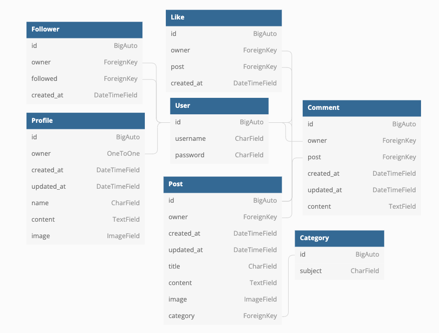

<h1 align="center" style="font-size: 250%;"><b>
llAMA API
</b></h1>

llAMA API is a fully functional API built specifically for the [llAMA](https://github.com/JFrdrkssn/llama) frontend application.

Users can register an account to access full CRUD functionality for different interactions across the site.
Permissions are set for handling restricted access on the frontend application.

[Link to deployed API](https://llama-drf-api.herokuapp.com/).

  

# **Data Model**

 

The backend API application is built with Django REST Framework.

 

## ERD

  

## User Model (AllAuth)

- ID of User is linked via a ForeignKey relation in the Post Model owner field.
- ID of User is linked via a OneToOne relation in the Profile Model owner field.
- ID of User is linked via a ForeignKey relation in the Follower Model owner field.
- ID of User is linked via a ForeignKey relation in the Follower Model followed field.
- ID of User is linked via a ForeignKey relation in the Comment Model owner field.
- ID of User is linked via a ForeignKey relation in the Like Model owner field.
    

## Post Model

- ID of Post is linked via a ForeignKey relation in the Comment Model post field.
    

## Category Model

- ID of Category is linked via a ForeignKey relation in the Post Model category field.
    

## Database

- SQLite is used in delevopment to store data.
- PostgreSQL is used in production to store data.

  

The Category model has not been fully completed and implemented and is therefore not currently used for the frontend application.

  

# **Agile**

 

## **Project Goals**

 

The general goal of this project is to build a custom backend API for the [llAMA](https://github.com/JFrdrkssn/llama) frontend application and expand them in tandem.

The immediate goal of this project was to build a custom backend API for the [llAMA](https://github.com/JFrdrkssn/llama) frontend application. It is fully functional in relation to the needs of the frontend application right now, the primary goal for this project.

 

## **User Stories**

 

  - ### Admin: users

    - As an admin, I can create, edit and delete users. set user permissions and usernames.
    - As an admin, I can set user permissions and usernames.
      

  - ### Admin: posts

    - As a admin, I can create, edit and delete posts.
      

  - ### Admin: profiles

    - As an admin, I can create, edit and delete profiles.
      

  - ### Admin: comments

    - As an admin, I can create, edit and delete comments.
      

No agile workflow tool is used for this project currently.

  

# **Future Features**

 

## _These features are planned._

- Expand the Category model
  - Expanding the category model and adding additional fields for subcategories etc.
      
- Expand the Profile model
  - Additional fields for users to add more info about themselves, for example age or job title.
      
- Image resizing and compression
  - Cloudinary, which is to store images, has an auto-transform function. This would help resize and compress images to prevent them from being too big and slowing down the site.
      

# **Technologies**

 

## **Languages**

- [Python](https://www.python.org/)

 

## **Programs, libraries, frameworks and dependencies**

- [Gitpod](https://gitpod.io)
  - Gitpod to host a virtual workspace.
- [Git](https://git-scm.com/)
  - Git for version control by utilizing the Gitpod terminal to commit and push to GitHub and Heroku.
- [GitHub](https://github.com/)
  - GitHub to store the project code after being pushed from Git.
- [Django REST Framework](https://www.django-rest-framework.org/)
  - Django REST Framework to build the backend API.
- [Django AllAuth](https://django-allauth.readthedocs.io/en/latest/index.html)
  - AllAuth for user authentication.
- [Cloudinary](https://cloudinary.com/)
  - Cloudinary for image hosting.
- [Heroku](https://id.heroku.com/login)
  - Heroku to host both the frontend and backends applications and connect them.
- [PostgreSQL](https://www.postgresql.org/)
  - PostgreSQL for deployed database.
- [Gunicorn](https://gunicorn.org/)
  - Gunicorn for WSGI HTTP on deployed site.
- [PyJWT](https://pyjwt.readthedocs.io/en/stable/)
  - PyJWT for encode and decode JSON Web Tokens.
- [Pillow](https://pillow.readthedocs.io/en/stable/)
  - Pillow for image processing and validation.
- [psycopg2](https://www.psycopg.org/docs/)
  - psycopg2 for PostgreSQL Python adaption.
- [dbdiagram](https://dbdiagram.io/home)
  - dbdiagram to create the ERD.
    

# **Testing**

 

PEP8 was used to validate the code.

- [PEP8](http://pep8online.com/) show no significant issues.
    

## **Testing User Stories from Agile section**

- ### Admin: users

    - As an admin, I can create, edit and delete users. set user permissions and usernames.
      - All functionality is working.
    - As an admin, I can set user permissions and usernames.
      - All functionality is working.
      

  - ### Admin: posts

    - As a admin, I can create, edit and delete posts.
      - All functionality is working.
      

  - ### Admin: profiles

    - As an admin, I can create, edit and delete profiles.
      - All functionality is working.
      

  - ### Admin: comments

    - As an admin, I can create, edit and delete comments.
      - All functionality is working.
      

  

## **Manual Testing**

 

### **Admin panel**

| Test       | Action            | Expected Result               | Pass |
| ---------- | ---------------- | --------------------------- | ---- |
| Users     | Create, edit, delete   | A user is created, edited or deleted.   | ✓    |
| Users     | Update permissions  | The user permissions are updated.      | ✓    |
| Profiles   | Create, edit, delete | A profile is created, edited or deleted.  | ✓    |
| Posts  | Create, edit, delete       | A post is created, edited or deleted.        | ✓    |
| Comments   | Create, edit, delete | A comment is created, edited or deleted.   | ✓    |

  

## **Bugs**
 

### Remaining Found Bugs

- The admin panel CSS is broken. This is common problem related to static files with Django.
  - Tried adding STATIC file path URLs to settings.py file. No success. The admin panel still works but looks wonky.
  

# **Deployment**
 

## **Development**
 

1.  Clone [this repository](https://github.com/JFrdrkssn/llama-be).
2.  Open your IDE (GitPod is recommended, since URL paths for development environment in settings.py are configured to work with GitPod URLs. You have to change these if you're not using GitPod) and connect to your repo, then enter this command in the terminal:
        
        pip install -r requirements.txt

- Make sure your INSTALLED_APPS in settings.py look like this:

        INSTALLED_APPS = [
        'django.contrib.admin',
        'django.contrib.auth',
        'django.contrib.contenttypes',
        'django.contrib.sessions',
        'django.contrib.messages',
        'cloudinary_storage',
        'django.contrib.staticfiles',
        'cloudinary',
        'rest_framework',
        'django_filters',
        'rest_framework.authtoken',
        'dj_rest_auth',
        'django.contrib.sites',
        'allauth',
        'allauth.account',
        'allauth.socialaccount',
        'dj_rest_auth.registration',
        'corsheaders',
        'profiles',
        'posts',
        'comments',
        'likes',
        'followers',
        'categories',
        ]

3. In you terminal, enter these commands in the terminal:

        python manage.py makemigrations
        python manage.py migrate

4.  Git add, commit and push all changes to your repo.
5.  Create or log in to an account on Heroku.
6.  Create a new app on Heroku.
7.  Open your app on Heroku, go to Resources, Add-ons and search for PostgreSQL, then add it.
8.  In the Deploy tab on Heroku, go to Deployment method and add your GitHub repository.
9.  In the Deploy tab on Heroku, go to Manual deploy and select deploy branch for early deployment.
10. Create or log in to an account on Cloudinary.
11. Copy your API Environment Variable.
12. Go back to Heroku, Settings and click on Reveal Config Vars.
13. Add these variables to your config vars. PostgreSQL DATABASE_URL should already be there.
    - ALLOWED_HOST | your_deployed_api_url
    - CLIENT_ORIGIN | your_deployed_frontend_url
    - CLIENT_ORIGIN_DEV | your_local_server_url
    - CLOUDINARY_URL | your_api_variable
    - SECRET_KEY | your_choice ([Secret Key Generator](https://miniwebtool.com/django-secret-key-generator/))
    - DISABLE_COLLECTSTATIC | 1
14. Create an env.py in the root directory, add it to .gitignore and add these lines at the top

        import os

        os.environ["SECRET_KEY"] = "your secret_key here"
        os.environ["CLOUDINARY_URL"] = "cloudinary url here"
        os.environ['DEV'] = '1'
15. Create a superuser for your site:

        python manage.py createsuperuser

16. To run your app locally, enter this command in your terminal:
        python manage.py runserver
     

The project is now set up to automatically switch between DEBUG: True and False for development server and deployed site.
  

## **Production**
 

1.  If changes has been made, make sure to run migrations:

        python manage.py makemigrations
        python manage.py migrate

2.  Git add, commit and push all changes to your repo.
3.  On Heroku, go to Deploy and and choose manual deploy.
4.  On Heroku, go to Settings and scroll down to Domains where you find the deployed URL.
      